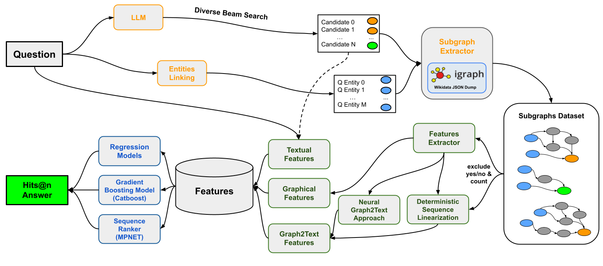
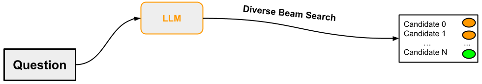
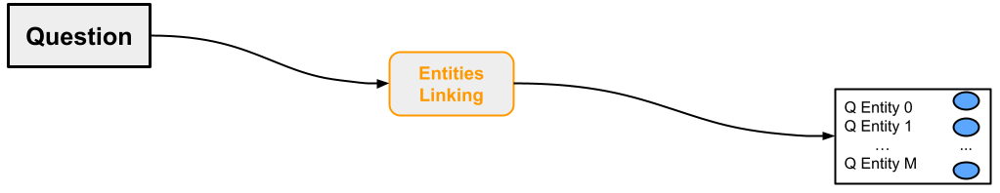
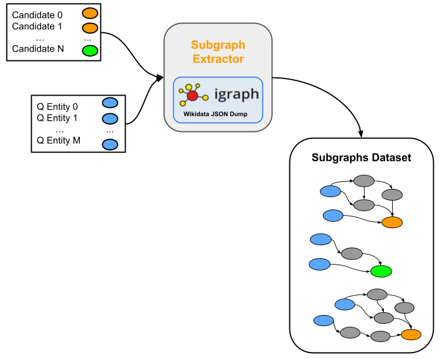

# Knowledge Graph Question Answering
<p align="center">
    
    
    
    
</p>

<p align="center">
🔔 <a href="https://github.com/s-nlp/kbqa" target="_self">Code</a> • 📃 <a href="https://aclanthology.org/2023.paclic-1.63/" target="_self">Original Paper</a> • 📃 <a href="https://aclanthology.org/2023.paclic-1.63/" target="_self">Extended Paper</a> • 🤗 <a href="https://huggingface.co/datasets/s-nlp/KGQASubgraphsRanking" target="_self">Dataset</a>  
</p>


This repository serves as an all-packaged KGQA system, hosts of the original paper [Large Language Models Meet Knowledge Graphs to Answer Factoid Questions](https://aclanthology.org/2023.paclic-1.63/) and its extended version Re-ranking
Answers by a Large Language Model
with Knowledge Graphs. The extended paper is currently in review for a journal. Once the process is finished, we will update the link here. 

### KGQA Overview

Our KGQA pipeline is a novel framework which enhances Large Language Models' performance on complex question answering task by ranking its answer candidates while leveraging Knowledge Graphs post generation. KGQA is based on the observation that, while the correct answer may not always be the most likely according to language model predictions, it often appears later within the sequence of generated predictions. The entire pipeline of the proposed KGQA pipeline is shown in the following figure.




Our KGQA pipelines includes generating answer candidates, entity linking for question entities, subgraphs generation, feature extractors for subgraphs, and various ranking models. All experiments for these papers were based on [Mintaka](https://www.google.com/search?q=mintaka+amazon) - a complex factoid question answering dataset. 

### 📝 Quick Links
- [📄 Knowledge Graph Question Answering - KGQA📑](#knowledge-graph-question-answering)
  - [🛣KGQA Overview](#kgqa-overview)
  - [🔨Answer Candidates Generation](#answer-candidates-generation)
  - [🔧Entity Linking](#entity-linking)
  - [🛠️Subgraphs Extraction](#subgraphs-extraction)
  - [🧰Subgraphs Feature Extraction](#subgraphs-feature-extraction)
  - [🧮Ranking Answer Candidates Using Subgraphs](#ranking-answer-candidates-using-subgraphs)
  - [📒Miscallaneous](#miscallaneous)

### Answer Candidates Generation

In the [original paper](https://aclanthology.org/2023.paclic-1.63/), we generated answer candidates using `T5-large-ssm` and `T5-xl-ssm`. To finetune your own T5-like models and generate a new batch of answer candidates:
```bash
python3 kbqa/seq2seq.py --mode train_eval --model_name t5-large
python3 kbqa/seq2seq.py --mode train_eval --model_name t5-3b
```
The generated candidates for the T5-like models will be `.csv` format.

In the extended paper, we added `Mistral` and `Mixtral` as answer candidates generating LLMs. To finetune your own Mistral/ Mixtral models and generate a new batch of answer candidates:
```bash
python3 kbqa/mistral_mixtral.py --mode train_eval --model_name mistralai/Mixtral-8x7B-Instruct-v0.1 
python3 kbqa/mistral_mixtral.py --mode train_eval --model_name mistralai/Mistral-7B-Instruct-v0.2
```
The generated candidates for the T5-like models and Mixtral/Mistral will be `.csv` and `.json` format, respectively. 

In both `seq2seq.py` and `mistral_mixtral.py`, you can other useful arguments, which includes tracking, training parameters, finetuning parameters, path for checkpoints etc. These arguments are detailed within the files themselves. Lastly, if you prefer to use our prepared finetuned models and generated candidates, we have uplodaed them to [HuggingFace](https://huggingface.co/datasets/s-nlp/KGQASubgraphsRanking).
### Entity Linking

In both of our papers, we decided to use the golden question entities provided by the Mintaka dataset. The scope of our research were solely on the novelty of the subgraphs and the efficacy of different ranking methods. 


### Subgraphs Extraction

You can either 1) use our prepared dataset at [HuggingFace](https://huggingface.co/datasets/s-nlp/KGQASubgraphsRanking) or 2) fetch your own dataset. **Please do note, if you'd like to fetch your own subgraphs dataset, the task is very computationally expensive on the CPU**. The extraction protocal can be divided into 2 steps.
 - parsing the Wikidata dump to build our Wikidata graph via iGraph.
 - load our Igraph representation of Wikidata and generate the subgraph dataset.

All subgraphs extraction codes can be found in `kbqa/subgraphs_dataset_creation/`.
#### Parsing Wikidata Dump 
Wikidata frequently releases and updates their [dumps](https://dumps.wikimedia.org/wikidatawiki/entities/), which can be found in various formats: JSON, RDF, XML, etc. Firstly, to utilise our code, download the dumps in JSON format. Then, to parse the wikidata json dump, run:

 ```bash
 python3 kbqa/subgraphs_dataset_creation/dump_repacker.py --data_path /path/to/downloaded_dump --save_path /path/to/parse_dump
 ```
 where the arguments:
 - `data_path` refers to the path where the json dump is stored.
 - `save_path` refers to the path where we want to save the igraph triple triples representation.

 After running the above script, a `wikidata_triples.txt` file will be created within the saved path mentioned in the argument above. This triples text file is ready to be loaded via Igraph via:
 ```python
 # graph_path is where we stored wikidata_triples.txt
 igraph_wikidata = Graph.Read_Ncol(
             graph_path, names=True, directed=True, weights=True
         )
 ```
Since parsing this Wikidata dump takes a long time, checkpoints were implemented. If for some unfortunate reason, our process crashed, you can simply rerun `kbqa/subgraphs_dataset_creation/dump_repacker.py`. The code will automatically continue parsing on where the crash happened.

#### Building the Subgraphs
After we have parsed the Wikidata dump and have our Igraph triples representation, we are ready for subgraphs dataset generation. Firstly, we need to pre-proccess Mintaka (fetch label for each Wikidata question entities, prepare the answer candidates by our LLM; all in 1 accessible `jsonl` file). To do so, please run the jupyter notebook `kbqa/experiments/subgraphs_datasets_prepare_input_data/mintaka_subgraphs_preparing.ipynb`. The input of this notebook are the answer candidates generated by our LLMs (`.csv` and `.json` formatting for T5-like and Mixtral/Mistral respectively).

Finally, to fetch the desired subgraphs, run:

```bash
python3 kbqa/subgraphs_dataset_creation/mining_subgraphs_dataset_processes.py
```
which have the following available arguments:
 - `--save_jsonl_path` indicates the path of the final resulting `jsonl` file (with our subgraphs).
 - `--igraph_wikidata_path` indicates the path of the file with our Igraph triples representation.
 - `--subgraphs_dataset_prepared_entities_jsonl_path` indicates the path of the preproccessed Mintaka dataset, output of `/experiments/subgraphs_datasets_prepare_input_data/mintaka_subgraphs_preparing.ipynb`.
 - `--n_jobs` indicates how many jobs for our multi-processing scheme. **ATTENTION**: Each process require ~60-80Gb RAM.  
 - `--skip_lines` indicates the number of lines for skip in prepared_entities_jsonl file (from `--subgraphs_dataset_prepared_entities_jsonl_path`).

 After running the above file, the final data will be a `jsonl` file in the path `--save_jsonl_path`

#### Dataset formattings:

Each entry in the final `.jsonl` file will represent one question-answer pair and its corresponding subgraph. One sample entry can be seen below:
```python
{"id":"fae46b21","question":"What man was a famous American author and also a steamboat pilot on the Mississippi River?","answerEntity":["Q893594"],"questionEntity":["Q1497","Q846570"],"groundTruthAnswerEntity":["Q7245"],"complexityType":"intersection","graph":{"directed":true,"multigraph":false,"graph":{},"nodes":[{"type":"INTERNAL","name_":"Q30","id":0},{"type":"QUESTIONS_ENTITY","name_":"Q1497","id":1},{"type":"QUESTIONS_ENTITY","name_":"Q846570","id":2},{"type":"ANSWER_CANDIDATE_ENTITY","name_":"Q893594","id":3}],"links":[{"name_":"P17","source":0,"target":0},{"name_":"P17","source":1,"target":0},{"name_":"P17","source":2,"target":0},{"name_":"P527","source":2,"target":3},{"name_":"P17","source":3,"target":0},{"name_":"P279","source":3,"target":2}]}}
```
One could simply turn these JSONL files into `pandas.DataFrame` format. We recommend to upload this [subgraph dataset on HuggingFace](s-nlp/Mintaka_Subgraphs_T5_xl_ssm) first. Then, in the next section, we could leverage this subgraph dataset to extract the features and finalise the final KGQA dataset. 


### Subgraphs Feature Extraction
In the [original paper](https://aclanthology.org/2023.paclic-1.63/), we introduced 2 main methods of ranking; which utilised the raw subgraphs itself and a simple linerisation algorithm - G2T Deterministic. In the extended paper, we extracted more features from the subgraphs, which include graph, text, and more G2T features. 

#### G2T T5 & GAP Generation
Firstly, we need to prepare the neural-based complex G2T sequences (G2T T5 \& G2T GAP). Unlike the neural-based G2T sequences, G2T Deterministic, introduced in the [original paper](https://aclanthology.org/2023.paclic-1.63/), is not complex (unravelling of the subgraph in its adjacency matrix representation). Therefore, G2T Determnistic sequences can be prepared along with simple graph features. With that in mind, G2T T5 \& GAP generation codes are stored inside `/kbqa/experiments/graph2text`

##### Finetuning T5 on WebNLG
To generate the G2T T5 and GAP sequences, we must first train T5 on WebNLG dataset, as mentioned on the extended paper. If you'd like you use our finetuned T5 WebNLG, we have uploaded these models to [HuggingFace](https://huggingface.co/s-nlp/g2t-t5-xl-webnlg). Otherwise, to train your own T5 on WebNLG, firstly download the [WebNLG dataset](https://drive.google.com/drive/folders/1Jx3Cz7t0hiNdtlBWUdPjhtLwPOH3LtzC) (link from the original [GAP repo](https://github.com/acolas1/GAP_COLING2022/tree/main)) and store it inside `kbqa/experiments/graph2text/data/webnlg`. For the config file for finetuning WebNLG T5 `kbqa/experiments/graph2text/configs/finetune_t5_webnlg.yaml`, please pay attention to the path for the train, dev, and test for the WebNLG dataset. With that in mind, please run:
```bash
python3 kbqa/experiments/graph2text/main_seq2seq.py -cd configs --config-name=finetune_t5_webnlg
```

##### Converting Mintaka Subgraph Dataset to WebNLG Format 
With the finetuned T5 and GAP on WebNLG, we can now generate G2T T5 and G2T GAP on the Mintaka dataset. Firstly, we need to prepare the Mintaka dataset into WebNLG format. To do so, run the notebook `kbqa/experiments/graph2text/preprocess_mintaka_webnlg.ipynb`. We need to prepare this format for T5-large-ssm, T5-xl-ssm, Mixtral, and Mistral (to do this: change `ds` variable to the desired dataset, and use our prepared subgraph dataset/set your own prepared subgraph dataset path). After running `kbqa/experiments/graph2text/preprocess_mintaka_webnlg.ipynb`, the datasets for T5-like and Mixtral/Mistral in WebNLG format should be stored in `kbqa/experiments/graph2text/data`. 

##### Finetuning T5 WebNLG on Mintaka Subgraphs
Firstly, to generate G2T T5 sequences, we need to edit the config files in `kbqa/experiments/graph2text/configs`. Place the path of the finetuned WebNLG (from [Converting Mintaka Subgraph Dataset to WebNLG Format](#converting-mintaka-subgraph-dataset-to-webnlg-format)) T5 in the `kbqa/experiments/graph2text/configs/model/t5_xl_checkpoint.yaml` file. Then, with the Mintaka subgraph dataset in WebNLG format (in `kbqa/experiments/graph2text/data`), configure the appropriate paths for train, val, and test for the desired LLM in `kbqa/experiments/graph2text/configs/dataset`. Lastly, run the following command for the desired [DATASET]:
```bash
python3 kbqa/experiments/graph2text/main_seq2seq.py -cd configs --config-name=graph2text_seq2seq_[DATASET]
```
After finishing these procedures, the G2T T5 dataset for the desired answer candidates LLM will be in `.yaml` format. 
##### Finetuning GAP WebNLG on Mintaka Subgraphs
To generate G2T GAP, we use the same Mintaka subgraph dataset in WebNLG format. Clone the [GAP Repo](https://github.com/acolas1/GAP_COLING2022/) and change the desired dataset path in `kbqa/experiments/graph2text/start_g2t_gap.sh`. Lastly, run:
```bash
kbqa/experiments/graph2text/start_g2t_gap.sh 
```
After finishing these procedures, the G2T GAP dataset for the desired answer candidates LLM will be in `.txt` format.   
##### Text, Graph, G2T Deterministic

Now that we have the complex neural-based G2T features, we can prepare the rest of our subgraph's features (which includes text, graph, and G2T Deterministic). Assuming we have stored the subgraphs dataset on HuggingFace, as recommended in the "[Buidling the Subgraph](#building-the-subgraphs)" section, we can extract the remaining subgraph features by running: 
```bash
python3 kbqa/experiments/subgraphs_reranking/graph_features_preparation.py --subgraphs_dataset_path HF_subgraphs_path  --g2t_t5_train_path path_to_generated_g2t_t5_train --g2t_t5_val_path path_to_generated_g2t_t5_val --g2t_t5_test_path path_to_generated_g2t_t5_test --g2t_gap_train_path path_to_generated_g2t_gap_train --g2t_gap_val_path path_to_generated_g2t_gap_val --g2t_gap_test_path path_to_generated_g2t_gap_test --upload_dataset True --hf_path HF_finalized_dataset_path
```
The output file will be a `.csv` file of the same format as the published [finalised HuggingFace dataset](https://huggingface.co/datasets/s-nlp/KGQASubgraphsRanking). **Please pay attention that one would need to repeat the "[Building the Subgraphs](#building-the-subgraphs)" and "[Subgraphs Feature Extraction](#subgraphs-feature-extraction)" sections for train, val, test for T5-large-ssm, T5-xl-ssm, Mistral, and Mixtral**. The [finalised HuggingFace dataset](https://huggingface.co/datasets/s-nlp/KGQASubgraphsRanking) already combined all data splits and LLMs into one total-packaged dataset.

### Ranking Answer Candidates Using Subgraphs
Using the [finalised dataset](https://huggingface.co/datasets/s-nlp/KGQASubgraphsRanking), we devised the following rankers:
- **Graph Transformer**: leveraging the raw subgraphs by itselves.
- **Regression-based**: Logistic and Linear Regression with graph features and MPNet embeddings of text and G2T features. 
- **Gradient Boosting**: Catboost with graph features and MPNet embeddings of text and G2T features.
- **Sequence Ranker**: MPNet with G2T features.

After training/fitting, all tuned rankers will generate the list of re-ranked answer candidates with the same skeleton, outlined in `/kbqa/experiments/subgraphs_reranking/ranking_model.py` (**beside Graphormer**). This list of re-ranked answer candidates (in `jsonl` format) is then evaluated with Hits@N metrics with `kbqa/mintaka_evaluate.py`
Evaluating
#### Training \&  Generating the Re-ranked Answers
**Graphormer:** As Graphormer was introduced in the original paper, it is the only ranker that was **not updated** to work with `kbqa/experiments/subgraphs_reranking/ranking_model.py` and `kbqa/mintaka_evaluate.py`. We are still working to refractor the code to the unified ranking pipeline, introduced in the extended paper. With that in mind, you can train the Graphormer model with:
```bash
python3 kbqa/experiments/subgraphs_reranking/graphormer/train_graphormer.py run_name graphormer_run
```
To evaluate, please load the trained model (inside of the desired `--output_path`) and run the notebook `/kbqa/experiments/subgraphs_reranking/graphormer/graphormer.ipynb`

**Regression-based:** As we don't "train" regression-based model but simply fit them, training \& generating Logistic and Linear Regression are both in `ranking.ipynb`. The fitted model will produce a `jsonl` file, which include the list of reranked answer candidates. 

**Gradient Boosting:** to train Catboost:
```bash
python3 kbqa/experiments/subgraphs_reranking/graph_features/train_catboost_regressor.py
```
For the Catboost code, there are several available arguments, which can be seen in details within `experiments/subgraphs_reranking/graph_features/train_catboost_regressor.py`. The most important arguments are:
- `ds_type`: which answer candidate LLM to use (T5-large-ssm, T5-xl-ssm, Mistral, or Mixtral)
- `use_text_features`: whether to use text features while training Catboost
- `use_graph_features`: whether to use graph features while training Catboost
- `sequence_type`: whether to use G2T features while training Catboost. If we don't want any G2T features, choose `none`; otherwise state the desired G2T sequence (`g2t_determ`, `g2t_t5`, or `g2t_gap`)

After training Catboost on the desired answer candidate LLM subgraph dataset, please load the path of the tuned model in `ranking.ipynb` to evaluate.  Please pay attention to the parameters of `CatboostRanker()` in `ranking.ipynb` (the different feature sets used must be pass in accordingly). It is important to note that the tuned model will generate and rank answer candidates to produce a ranking `.jsonl` file.

**Sequence Ranker:** to train the sequence ranker:
```bash
python3 kbqa/experiments/subgraphs_reranking/sequence/train_sequence_ranker.py
```
For the sequence ranker code, there are several available arguments, which can be seen in details within `experiments/subgraphs_reranking/graph_features/train_catboost_regressor.py`. The most important arguments are:
- `sequence_type`: which sequence type used to rank (g2t_determ, g2t_gap, g2t_t5, or just question_answer concatenation) 
- `do_highlighting`: to whether use the highlighted sequence (wrapping special tokens around the answer candidate)
- `model_name`: model used to classify the sequence. The default model is [MPNet](sentence-transformers/all-mpnet-base-v2).

After training sequence ranker on the desired answer candidate LLM subgraph dataset and sequence, please load the path of the tuned model in `ranking.ipynb` to evaluate. Please pay attention to the parameters of `MPNetRanker()` in `ranking.ipynb` (the different sequence used must be pass in accordingly). It is important to note that the tuned model will generate and rank answer candidates to produce a ranking `.jsonl` file.

#### Hits@N Evaluation
After producing the new list of re-ranked answer candidates, you can evaluate this `.jsonl` file by running:
```bash
python3 kbqa/mintaka_evaluate.py --predictions_path path_to_jsonl_prediction_file
```
Running the above code will produce the final evaluation of our ranker. The evaluation includes Hits@1-5 for the entire Mintaka dataset and each of the question type (intersection, comparative, generic, etc.). 

### Miscallaneous 
#### Build \& Run KGQA Docker Environment
We have prepared a Docker environment for all experiments outlined above. Please run:
```bash
docker build -f ./Dockerfile -t kbqa_dev ./
docker run -v $PWD:/workspace/kbqa/ --network host -ti kbqa_dev
```
#### Wikidata Utils
As this repository was researched and implemented with Wikidata as the Knowledge Graph, we have implemented several modules to work with the Wikidata Query API. All of the implemented modules can be found at `kbqa/kbqa`.

##### Wikdiata Config
Firstly, Wikidata SPARQL endpoint and engine can be configured in `kbqa/kbqa/config.py`. By default, please use query.wikidata.org

```python
SPARQL_ENDPOINT = "https://query.wikidata.org/sparql"
SPARQL_ENGINE = "blazegraph"
```

As an alternative, to use a graphDB instance of Wikidata, use the following config. Please do not forget to forward 7200 port to your machine.  
```python
SPARQL_ENDPOINT = "http://localhost:7200/repositories/wikidata"
SPARQL_ENGINE = "graphdb"
```

##### Wikidata Tools
All of the different Wikidata tools can be found in `kbqa/kbqa/wikidata`. The implemented tools include the following (with caching implemented):
- entity to label: converting Wikidata entity ID to label(s)
- label to entity: converting label to Wikidata entity ID(s)
- shortest path: return the shortest path(s) between `entity1` and `entity2`
- property: return the property of an entity
- redirects: return all the redirects of an entity
- relationship: return the relationship of an entity
- subgraphs retriever: same idea as "[Subgraphs Extraction](#subgraphs-extraction)", but by requesting Wikidata Query service
  - entity similarity: returns the similarity score between `entity1` and `entity2`

One could use any of the above tools by:
```python
from kbqa.wikidata import (
    WikidataEntityToLabel,
    WikidataShortestPathCache,
    WikidataLabelToEntity,
    WikidataRedirectsCache,
    wikidata_entity_similarity,
    ...
)
```
Examples of the above Wikidata tools can be found in `kbqa/wikidata_tools_example.ipynb`
### Future Work, Citation & Contacts

If you find some issues, do not hesitate to add it to [Github Issues](https://github.com/s-nlp/kbqa/issues).

For any questions please contact: [Mikhail Salnikov](mailto:salnikov@airi.net), [Hai Le](mailto:hai.le@skol.tech), or [Alexander Panchenko](mailto:alexander.panchenko@skol.tech)

```bibtex
@inproceedings{salnikov-etal-2023-large,
    title = "Large Language Models Meet Knowledge Graphs to Answer Factoid Questions",
    author = "Salnikov, Mikhail  and
      Le, Hai  and
      Rajput, Prateek  and
      Nikishina, Irina  and
      Braslavski, Pavel  and
      Malykh, Valentin  and
      Panchenko, Alexander",
    editor = "Huang, Chu-Ren  and
      Harada, Yasunari  and
      Kim, Jong-Bok  and
      Chen, Si  and
      Hsu, Yu-Yin  and
      Chersoni, Emmanuele  and
      A, Pranav  and
      Zeng, Winnie Huiheng  and
      Peng, Bo  and
      Li, Yuxi  and
      Li, Junlin",
    booktitle = "Proceedings of the 37th Pacific Asia Conference on Language, Information and Computation",
    month = dec,
    year = "2023",
    address = "Hong Kong, China",
    publisher = "Association for Computational Linguistics",
    url = "https://aclanthology.org/2023.paclic-1.63",
    pages = "635--644",
}
```

